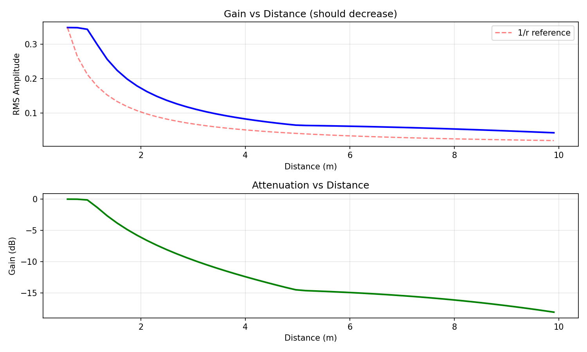
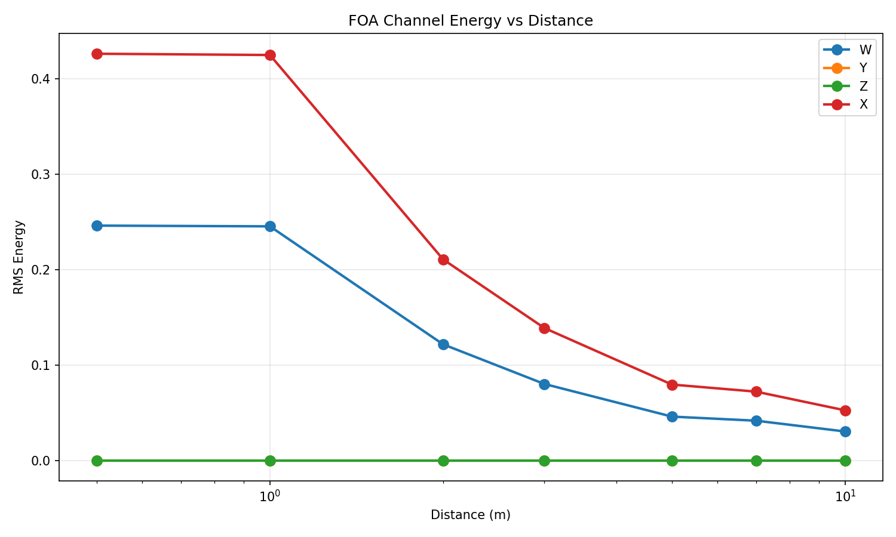
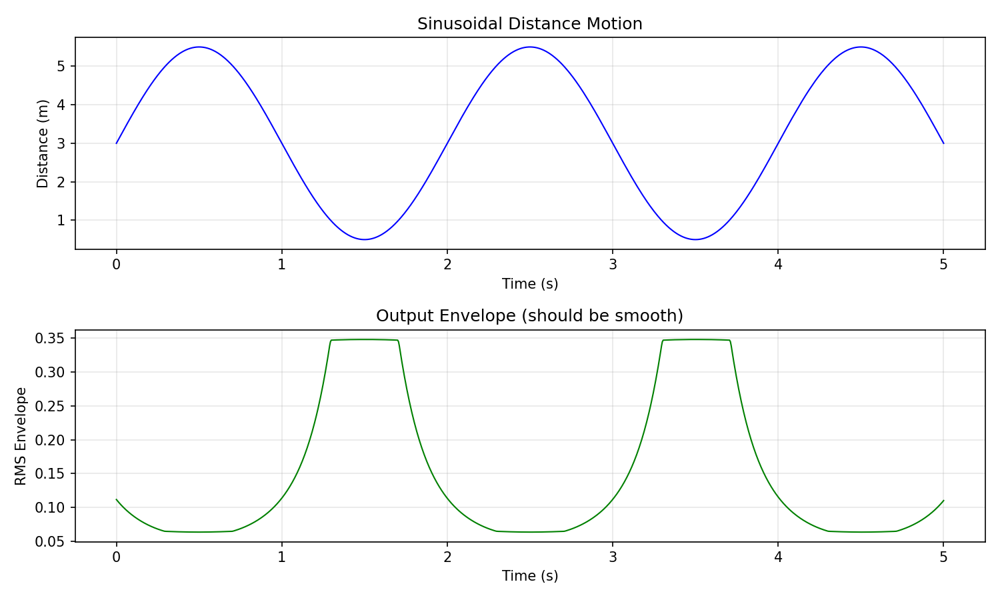

# FOA Distance Rendering Validation Report

## Summary

| Test | Result |
|------|--------|
| gain_monotonicity | ✓ PASS |
| foa_energy | ✓ PASS |
| smoothness | ✓ PASS |
| d_rel_lpf_mapping | ✓ PASS |
| reverb_mapping | ✓ PASS |

**Overall: ALL TESTS PASSED**

## Test Details

### Test 1: Gain Monotonicity

Verifies that audio amplitude decreases as distance increases.

- RMS at 0.5m: 0.3479
- RMS at 10m: 0.0434
- Gain ratio: 8.01x
- Total attenuation: -18.1 dB

### Test 2: FOA Energy Behavior

Verifies that FOA channels attenuate appropriately with distance.

- X channel attenuation: 0.4263 → 0.0525

### Test 3: Smoothness

Verifies no discontinuities in distance-varying gain.

- Discontinuities detected: 0

### Test 4: d_rel → LPF Cutoff Mapping

Verifies that LPF cutoff decreases with distance (farther = more filtering).

| Distance | d_rel | Cutoff |
|----------|-------|--------|
| 0.5m | 0.00 | 8000Hz |
| 1.0m | 0.05 | 7087Hz |
| 3.0m | 0.26 | 4364Hz |
| 5.0m | 0.47 | 2688Hz |
| 7.0m | 0.68 | 1655Hz |
| 10.0m | 1.00 | 800Hz |

### Test 5: Reverb Mapping

Verifies that reverb wetness increases with distance.

| d_rel | wetness |
|-------|----------|
| 0.00 | 0.050 |
| 0.25 | 0.125 |
| 0.50 | 0.200 |
| 0.75 | 0.275 |
| 1.00 | 0.350 |

## Interpretation

The FOA distance rendering model implements:

1. **Gain attenuation**: 1/r law with floor at 0.2 (prevents complete silence)
2. **Low-pass filtering**: Log-scaled cutoff from d_rel (consistent across tracks)
3. **Reverb wetness**: Linear mapping from d_rel (more reverb = farther)

The use of `d_rel` (normalized 0-1) instead of raw distance ensures:
- Consistent perceptual mapping regardless of absolute distance range
- Predictable DAW parameter mapping
- Comparable results across different video scenarios
