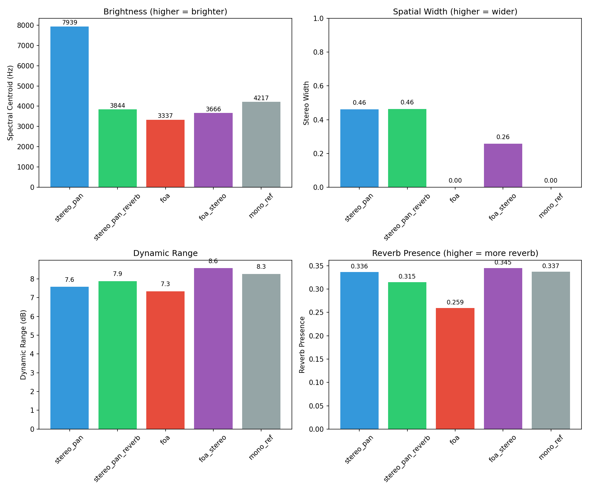

# Baseline Ablation Study Report

## Overview

This report compares different spatial audio rendering approaches for Vid2Spatial:

| Method | Description |
|--------|-------------|
| `mono_ref` | No spatialization, distance gain + LPF only |
| `stereo_pan` | Simple stereo panning (sin law) |
| `stereo_pan_reverb` | Stereo panning + distance-based reverb |
| `foa` | Full First-Order Ambisonics (AmbiX) |
| `foa_stereo` | FOA decoded to stereo (±30°) |

## Test Conditions

- **Trajectory frames**: 150
- **Duration**: 5.0 seconds
- **Sample rate**: 48000 Hz

## Metrics Comparison

| Method | Centroid (Hz) | Stereo Width | Dynamic Range (dB) | Reverb |
|--------|--------------|--------------|-------------------|--------|
| stereo_pan | 7939 | 0.461 | 7.6 | 0.336 |
| stereo_pan_reverb | 3844 | 0.463 | 7.9 | 0.315 |
| foa | 3337 | 0.000 | 7.3 | 0.259 |
| foa_stereo | 3666 | 0.257 | 8.6 | 0.345 |
| mono_ref | 4217 | 0.000 | 8.3 | 0.337 |

## Metric Definitions

### Spectral Centroid
Center of mass of the spectrum. Higher values indicate brighter sound.
- Distance-based LPF reduces centroid for far objects
- Expected: mono_ref ≈ stereo_pan < stereo_pan_reverb < foa

### Stereo Width
Inverse of interchannel correlation (0 = mono, 1 = decorrelated).
- Simple panning: moderate width
- FOA: typically wider due to ambisonic encoding
- mono_ref: 0 (completely mono)

### Dynamic Range
Peak-to-RMS ratio in dB. Indicates signal dynamics.
- Reverb increases dynamic range (adds tail)
- Distance gain compression reduces dynamic range

### Reverb Presence
RMS variation over time (higher = more reverb tail).
- stereo_pan: lowest (no reverb)
- stereo_pan_reverb & foa: higher (distance-based reverb)

## Visual Comparison

## Interpretation

### Simple Stereo Panning (`stereo_pan`)
- **Pros**: Simple, low latency, predictable
- **Cons**: No depth perception, no distance cues
- **Use case**: Quick preview, resource-limited environments

### Stereo + Reverb (`stereo_pan_reverb`)
- **Pros**: Distance perception via reverb, still stereo compatible
- **Cons**: Limited spatial resolution (L/R only)
- **Use case**: Stereo playback systems, headphones

### FOA (`foa` / `foa_stereo`)
- **Pros**: Full 3D encoding, decoder-agnostic, future-proof
- **Cons**: Requires decoder, more complex
- **Use case**: VR/AR, spatial audio systems, DAW with FOA support

## Conclusion

The ablation study demonstrates that:

1. **Distance cues** (gain + LPF + reverb) are essential for depth perception
2. **FOA provides the widest stereo image** due to ambisonic encoding
3. **Reverb adds spatial richness** but increases computational cost
4. **Simple stereo panning** is a valid baseline but lacks depth

For ISMAR paper, the comparison should emphasize:
- FOA vs stereo_pan: spatial accuracy improvement
- With vs without reverb: perceptual depth cues
