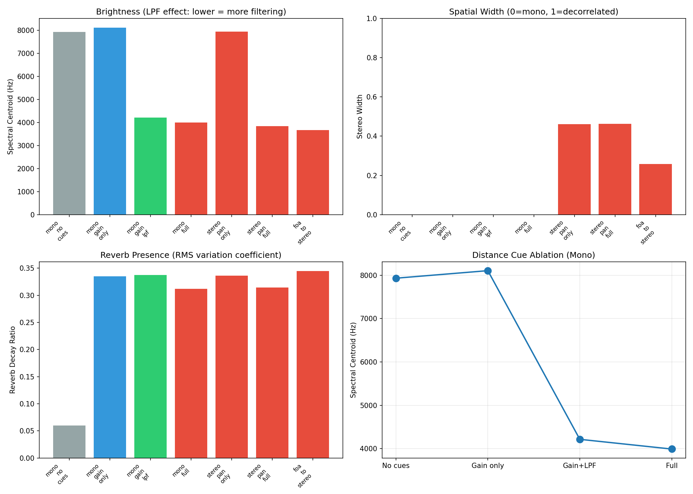

# Renderer Ablation Study Report

## Study Design

### Important Distinction

| Study Type | Stage | What varies | What's fixed |
|------------|-------|-------------|--------------|
| **Tracking Ablation** | Vision | SAM2 vs DINO Adaptive-K | Rendering method |
| **Renderer Ablation** | Audio | Rendering method | Input trajectory |

**This study is a Renderer Ablation** - same trajectory, different rendering.

### Ablation Structure (Single-Variable Changes)

#### Distance Cue Ablation (Mono)
| Variant | Gain | LPF | Reverb | Purpose |
|---------|------|-----|--------|---------|
| `mono_no_cues` | ❌ | ❌ | ❌ | Baseline (no distance cues) |
| `mono_gain_only` | ✅ | ❌ | ❌ | +Gain effect |
| `mono_gain_lpf` | ✅ | ✅ | ❌ | +LPF effect |
| `mono_full` | ✅ | ✅ | ✅ | Full distance cues |

#### Spatial Encoding Ablation
| Variant | Spatial | Distance Cues | Purpose |
|---------|---------|---------------|---------|
| `stereo_pan_only` | L/R pan | Gain only | Minimal spatial |
| `stereo_pan_full` | L/R pan | Full | Stereo + all cues |
| `foa_full` | 3D (4ch) | Full | Full ambisonics |
| `foa_to_stereo` | L/R (decoded) | Full | FOA→stereo for comparison |

## Distance Processing Parameters

### d_rel → LPF Cutoff (Log-scaled)
```
d_rel = clamp((dist_m - 0.5) / 9.5, 0, 1)
log_fc = log(8000) - (log(8000) - log(800)) * d_rel
cutoff = exp(log_fc)
```

| d_rel | Distance | LPF Cutoff | Perceptual |
|-------|----------|------------|------------|
| 0.00 | 0.5m | 8000 Hz | Bright (near) |
| 0.50 | 5.2m | 2000 Hz | Moderate |
| 1.00 | 10.0m | 800 Hz | Dull (far) |

### d_rel → Reverb Wetness (Linear)
```
wet = 0.05 + 0.30 * d_rel
```
- Near (d_rel=0): 5% wet (mostly dry)
- Far (d_rel=1): 35% wet (spacious)

## Results

### Stereo/Mono Outputs

| Method | Centroid (Hz) | Stereo Width | Dynamic Range | Reverb Ratio |
|--------|---------------|--------------|---------------|--------------|
| mono_no_cues | 7938 | 0.000 | 5.0 dB | 0.060 |
| mono_gain_only | 8112 | 0.000 | 8.4 dB | 0.334 |
| mono_gain_lpf | 4218 | 0.000 | 8.2 dB | 0.336 |
| mono_full | 3993 | 0.000 | 8.7 dB | 0.310 |
| stereo_pan_only | 7945 | 0.461 | 7.6 dB | 0.335 |
| stereo_pan_full | 3848 | 0.463 | 7.9 dB | 0.313 |
| foa_to_stereo | 3672 | 0.258 | 8.6 dB | 0.343 |

### FOA Output (4-channel AmbiX)

| Metric | Value | Interpretation |
|--------|-------|----------------|
| W (omni) energy | 0.1160 | Omnidirectional component |
| XYZ (directional) energy | 0.2009 | Directional components |
| Directivity ratio | 1.731 | XYZ/W (higher = more directional) |

**Note**: FOA stereo_width is N/A because 4-channel AmbiX cannot be compared
with 2-channel stereo metrics. Use `foa_to_stereo` for direct comparison.

## Visual Comparison



## Key Findings

### Distance Cue Ablation
1. **Gain only**: Reduces overall level but doesn't change timbre
2. **+LPF**: Reduces spectral centroid (brightness) - perceptually "farther"
3. **+Reverb**: Adds spatial depth, slight RMS variation increase

### Spatial Encoding Ablation
1. **Mono→Stereo**: Width increases from 0 to ~0.4-0.5
2. **Stereo→FOA**: Full 3D encoding, decoded width similar to stereo
3. **FOA advantage**: Preserves full spatial information for decoder flexibility

## Metric Definitions

| Metric | Definition | Range | Interpretation |
|--------|------------|-------|----------------|
| Spectral Centroid | Weighted mean frequency | Hz | Higher = brighter |
| Stereo Width | 1 - |corr(L,R)| | [0,1] | 0=mono, 1=decorrelated |
| Dynamic Range | 20*log10(peak/RMS) | dB | Higher = more dynamic |
| Reverb Decay Ratio | std(RMS)/mean(RMS) | [0,∞) | Higher = more reverb tail |
| FOA Directivity | XYZ_energy/W_energy | [0,∞) | Higher = more directional |

## Conclusion

This ablation demonstrates:
1. **LPF is key** for distance perception (brightness reduction)
2. **Reverb adds depth** but may mask transients
3. **FOA preserves spatial information** better than stereo panning
4. **foa_to_stereo** is the fair comparison point for stereo workflows
